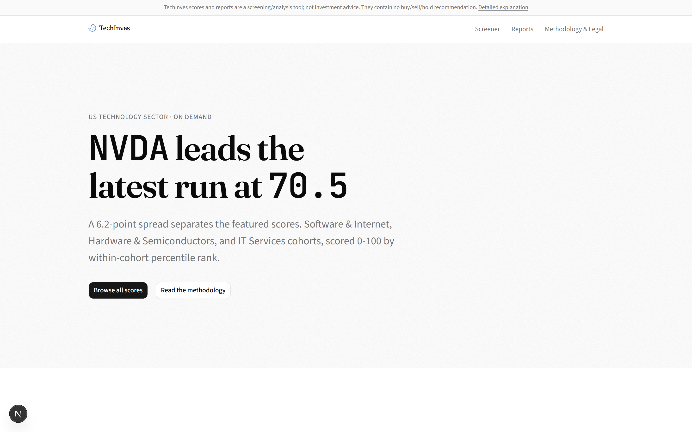
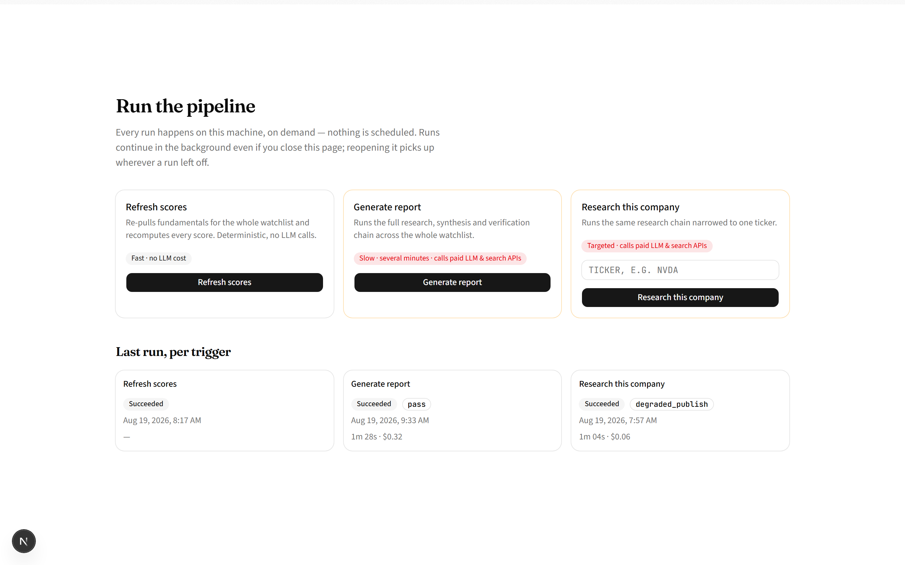
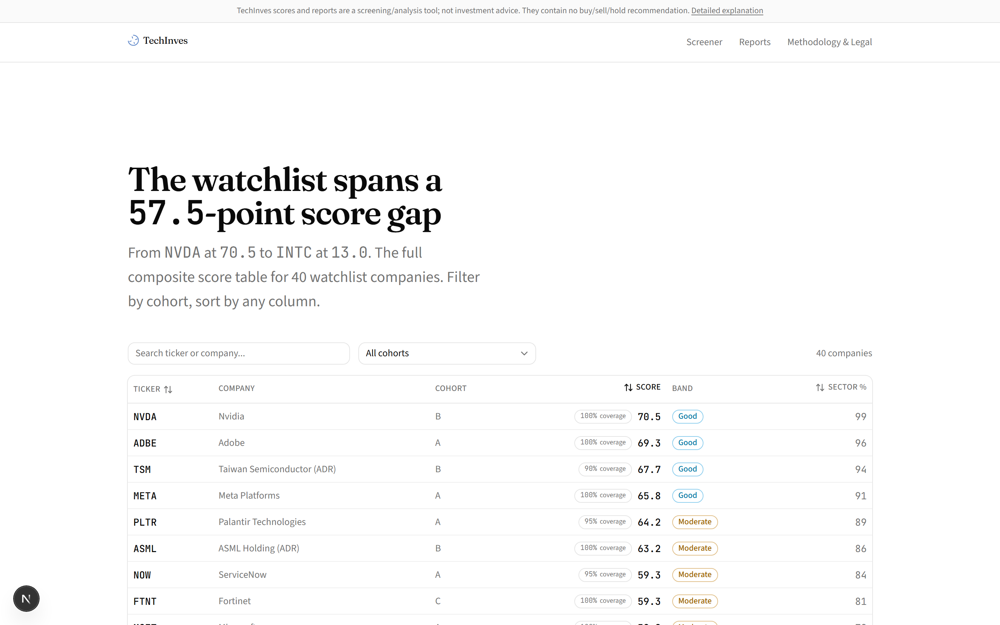
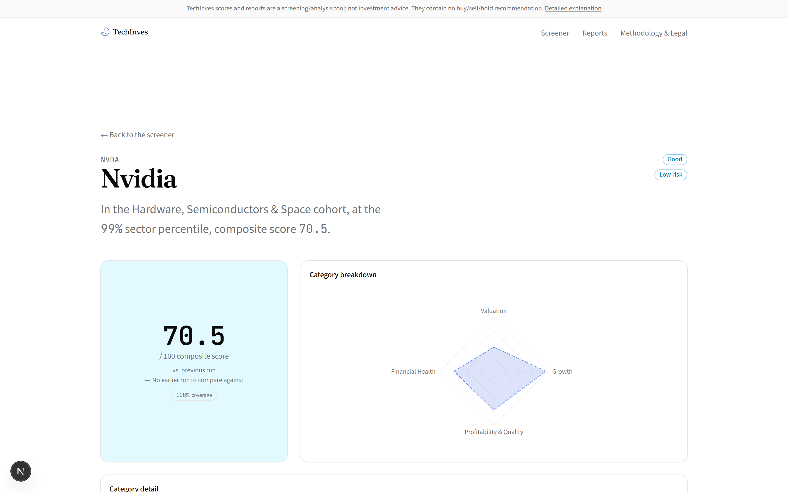
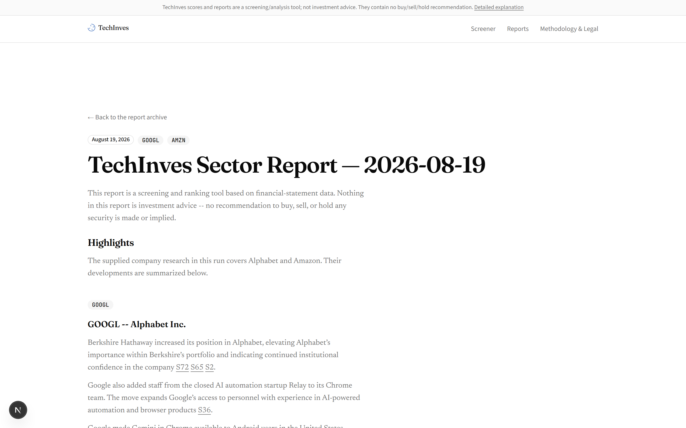

# TechInves

A self-hosted, single-user tool for scoring and researching the US technology
sector. You clone it, optionally supply your own API keys, and press a button
when you want fresh scores or a new report — nothing is scheduled, nothing is
delivered to anyone else.

Two layers:

- **Composite scoring** — deterministic and LLM-free. Company fundamentals come
  from [SEC EDGAR](https://www.sec.gov/edgar)'s XBRL `companyfacts` API, share
  price and market cap from [Financial Modeling Prep](https://financialmodelingprep.com/)'s
  free `profile` endpoint. Each company is scored 0-100 by percentile rank
  within its cohort (Software & Internet / Hardware & Semiconductors / IT
  Services) across four categories — valuation, growth, quality, financial
  health — plus a separate risk score (Altman-Z, Piotroski-F, leverage,
  dilution).
- **Report pipeline** — a LangGraph graph that runs only when you trigger it:
  a cheap search probe ranks the watchlist and picks 3-4 highlight companies,
  research branches fan out over those companies plus ten fixed macro topics
  (news search over a rolling last-7-days window, restricted to a trusted
  domain list, plus SEC filings, company IR feeds, and the Federal Register),
  an LLM synthesizes the findings into a report, and a rule-based + LLM-judge
  verifier grades the draft before it is published (`pass`, `pass_with_flags`,
  `degraded_publish`, or `block` — every verdict is stored and shown, never
  silently discarded).

The back end is FastAPI + SQLAlchemy (sqlite by default, Postgres via
`DATABASE_URL`); the front end is Next.js.

[**docs/pipeline.md**](docs/pipeline.md) diagrams the report pipeline in detail:
the pre-graph selection step, the LangGraph fan-out, every place an LLM is
called, and how the verifier's verdict is decided.

## What it looks like

The landing page leads with the latest run's headline score and the on-demand
run panel — three triggers, each labelled with its real cost, each showing its
last run's outcome:





The screener is the full watchlist as a sortable, cohort-filterable composite
score table; every company opens into a detail page with a category-breakdown
radar and run-over-run deltas:





A generated report carries the verifier's verdict, per-company deep-dives with
cited sources, the full watchlist score table, and a macro section — every
claim traceable to a source or a deterministic score field:



## Setup

Three commands get a fully populated, navigable site running with **zero API
keys**:

```bash
pip install -e ".[api-dev]"
alembic upgrade head && techinves-seed-mock --reset
uvicorn techinves.api.main:app --reload
```

That's demo mode: the app notices no required key is set, seeds itself from
committed fixture data, and serves it — five sample reports spanning the
verifier's verdict range, 40 sample company scores, all fully browsable. A
banner at the top of every page says so explicitly, and the three run triggers
are visibly disabled, each naming the specific key it's missing.

The front end runs separately:

```bash
npm install --prefix front-end
npm run dev --prefix front-end
# -> http://localhost:3000 (expects the API on :8000)
```

To go live, copy `.env.example` to `.env`, fill in your keys, and restart:

| Key | Required for | If absent |
|---|---|---|
| `FMP_API_KEY` | every trigger (`scores`, `report`, `company`) | that trigger refuses, naming this key |
| `OPENAI_API_KEY` | `report`, `company` | refuses, naming this key |
| `TAVILY_API_KEY` | `report`, `company` | refuses, naming this key |
| `SEC_EDGAR_USER_AGENT` | EDGAR requests | SEC wants a contact address — set your own |
| `FRED_API_KEY` | optional | the macro spine table is simply empty |
| `EXA_API_KEY` | optional | no fallback search leg; Tavily-only |

No key is ever silently ignored or partially applied: a trigger either has
everything it needs and runs, or is disabled with the one environment variable
that would unblock it. Going live does not re-seed or clear the demo fixtures;
`techinves-seed-mock --reset` is the only thing that does.

## Run triggers

Three units of work, invocable from the UI's run panel or directly:

```
POST /v1/runs           {"triggerType": "scores" | "report" | "company", "ticker": "..."}  -> 202, {runId, status: "queued"}
GET  /v1/runs           history, newest first, paginated (page / pageSize)
GET  /v1/runs/{id}      status + log tail; poll with ?log_offset=N (monotonic cursor)
```

- **`scores`** ("Refresh scores") — re-pulls fundamentals for the whole
  watchlist and recomputes every score. Deterministic, no LLM calls,
  ~40 EDGAR + ~40 FMP requests.
- **`report`** ("Generate report") — the full research/synthesis/verification
  chain over the whole watchlist. Several minutes; calls paid LLM & search APIs.
- **`company`** ("Research this company") — the same chain narrowed to one
  ticker, which is pinned as the report's highlight.

One run per trigger type may be in flight at a time. Refusals are
machine-readable, never prose alone:

| Situation | Status | `code` |
|---|---|---|
| unknown `triggerType` | 422 | `UnknownTriggerType` |
| `company` with no ticker / off-watchlist ticker | 422 | `TickerRequired` / `UnknownTicker` |
| a ticker given for a non-`company` trigger | 422 | `UnexpectedTicker` |
| a required API key is absent | 503 | `MissingApiKey`, naming the key |
| startup reconciliation not finished | 503 | `RunNotReconciled` |
| a run of that type already in flight | 409 | `RunRefused`, naming the run holding the lock |

Runs execute in a background thread on the API process: closing the page does
not stop a run, and reopening it resumes the live log from where it left off.
A mid-run crash resumes from its last completed step (LangGraph checkpointing)
instead of re-buying every research branch.

## CLI usage

```bash
# Score a single ticker (fetches/scores its full cohort - percentiles are cohort-relative)
python -m techinves score --ticker NVDA

# Score the whole watchlist, or one cohort
python -m techinves score-watchlist
python -m techinves score-watchlist --cohort B

# Force-refresh the cached EDGAR/FMP responses (e.g. right after earnings season)
python -m techinves score-watchlist --refresh-cache

# Machine-readable output
python -m techinves score --ticker NVDA --format json

# Raw fetched fields + unnormalized metric values for one ticker (2 requests,
# no scoring) - for verifying the data integration itself
python -m techinves debug-ticker --ticker NVDA

# Ingest a scoring run into the API's database
python -m techinves score-watchlist --format json > scores.json
techinves-ingest scores.json --run-id scores-20260817T101500

# Run the report pipeline without the API/UI
python -m pipeline.run --label my-run          # full watchlist
python -m pipeline.run --tickers NVDA          # narrowed
```

A single-ticker score still fetches its whole cohort because percentile
normalization is a whole-cohort operation — a company's score is its rank
relative to peers. `score --ticker` is a convenience for *displaying* one
company, not a way to avoid the cohort-wide computation.

Ingestion validates against the `ScoreBlock` schema before writing anything
and is idempotent by `(ticker, run_id)`: re-running the same file under the
same run id is a no-op; a new run id adds a history point.

## Data sources and rate limits

Per ticker, a refresh costs **one** EDGAR request and **one** FMP request:

| Source | What it provides | Auth | Limit |
|---|---|---|---|
| SEC EDGAR `companyfacts` | income statement, balance sheet, cash flow, filing history | none — a contact `User-Agent` is required | 10 req/s, no daily cap |
| FMP `profile` | share price, market cap, sector/industry | `FMP_API_KEY` | ~250 requests/day (free tier) |

SEC rejects requests whose `User-Agent` carries no contact address — set
`SEC_EDGAR_USER_AGENT` to a name and a reachable address of your own (the
default in `config.py` is a placeholder). `EdgarClient` throttles itself to
SEC's published 10 req/s. Responses are cached to disk (`.cache/`, 24h TTL),
mainly for payload size — `companyfacts` documents run 0.5-4 MB each.

The watchlist (`data/watchlist.yaml`) has 43 tickers; 40 are scored. RKLB,
ASTS and SPCX are research-only — they appear in reports' news coverage but
are excluded from financial scoring (pre-revenue / no filing history thick
enough to score honestly). A full refresh is ~40 EDGAR + ~40 FMP requests,
comfortably inside both budgets.

Coverage notes, verified live against all 40 scored tickers (40/40 resolve):

- **ASML** files only in EUR; figures are FX-translated at ECB reference
  rates before any USD ratio is computed. TSM files both TWD and USD; the
  USD figures are used.
- **IBM** doesn't tag operating income under any accepted concept name; the
  affected metrics are marked unavailable and their weight is redistributed
  within the category. The company still scores.

## Tests

```bash
pytest                    # back end + pipeline (no test hits the network)
npm test --prefix front-end
```

The suite is gated on the extras it needs: with only `.[dev]` installed,
`pytest` runs the unit and golden tests and skips collection of `tests/api`,
`tests/runs` and `tests/pipeline` (they import FastAPI/httpx and LangGraph).
`pip install -e ".[api-dev,pipeline]"` collects everything. API tests use an
in-memory sqlite DB per test, and ingestion is tested against real scoring
engine output — a 13-company synthetic cohort — not hand-written fixtures.

## Layout

```
src/techinves/        scoring engine, FastAPI app, run service, DB models
pipeline/             the LangGraph report pipeline (research, synthesis, verifier)
front-end/            Next.js site (screener, company detail, reports, run panel)
data/                 watchlist + ticker->name table
tests/                unit / golden / api / runs / pipeline suites
alembic/              schema migrations
```
