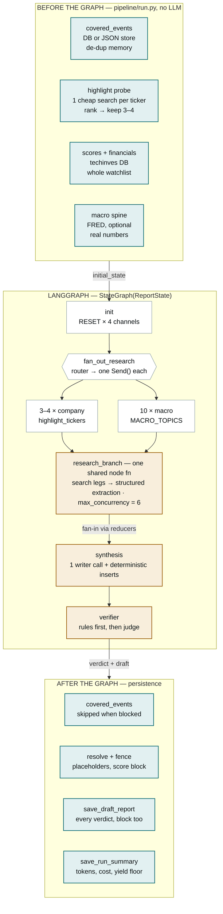
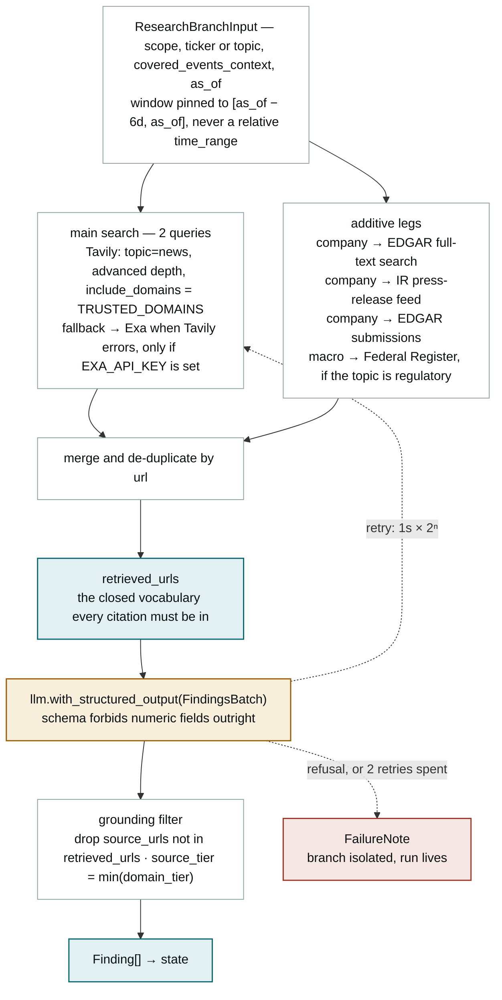

# The report pipeline

How one run turns the watchlist into a graded sector report: what happens before
the graph is invoked, where the search providers are actually called, the four
places an LLM is reached, and the rule that decides whether the draft ships.

Companion to [CLAUDE.md](../CLAUDE.md)'s architecture summary — this document is
the mechanism, drawn from `pipeline/graph.py`, `pipeline/research/agent.py`,
`pipeline/research/highlight_selection.py`, `pipeline/synthesis/node.py`,
`pipeline/verifier/node.py` and `pipeline/verifier/rules.py`.

Throughout, the diagrams use one distinction: **teal is deterministic and
LLM-free**, **amber is an LLM invocation**, **red is a failure or block path**.

## First, what this is not

There is no ReAct loop and no tool calling in this pipeline. `bind_tools`,
`create_react_agent`, `ToolNode`, `AgentExecutor` and `@tool` appear nowhere in
the repository. No model ever decides which tool to invoke.

Search providers are called directly from Python on a fixed schedule. The LLM is
reached only through `with_structured_output(...)` for extraction and judging,
and a plain `invoke` for writing. The only loop inside a research branch is a
*retry* loop — exponential backoff around a failed call — not a reasoning loop.

What looks agentic from the outside is a static DAG with injected clients.

## The whole run, end to end

Everything expensive is decided before the graph is invoked. Highlight
selection, scores and the macro spine are graph *input*, so the fan-out width is
already known when `init` runs.

The graph is four nodes deep. Its width is decided outside it: the cheap probe
fixes the company branch count at three or four before `build_graph()` is ever
called, so the two selections the site shows — highlight badges and deep-dive
sections — agree by construction rather than by reconciliation after the fact.

## Inside one research branch

This is where every external call lives. Each leg is additive: an empty or
failing leg contributes zero results, never a branch failure. The set of URLs
that actually came back — `retrieved_urls` — is the only thing a citation is
later allowed to point at.

The retry arc is the only cycle in the system. A refusal short-circuits it
immediately — retrying a content filter buys nothing but quota — while a timeout
or rate limit gets two backed-off attempts before the branch degrades to a
`FailureNote` the report will name in its Coverage Notes.

## Every LLM invocation in a run

Four call sites, and only three of them are wired into the graph. Token and cost
accounting binds a fresh usage handler per call, so concurrent branches never
share an accumulator.

| Call site | Model | Shape | Calls per run |
| --- | --- | --- | --- |
| `research/agent.py` | `WRITER_MODEL` | structured → `FindingsBatch` | 13–14, one per branch |
| `synthesis/node.py` | `WRITER_MODEL` | plain `invoke` → markdown | 1, the whole draft |
| `verifier/node.py` | `JUDGE_MODEL` | structured → section scores 0–10 | 0–1, skipped on `block` |
| `synthesis/section_synthesis.py` | `WRITER_MODEL` | plain `invoke` → one company's prose | 0 — not a graph node yet |

A blocked verdict never reaches the judge: the rule layer is authoritative for
`block`, so paying for a consistency review of an unpublishable draft is skipped
by design.

## State and fan-in

Thirteen or fourteen branches write concurrently into four channels. `init`
emits a `RESET` sentinel first, so re-invoking a checkpointed thread starts from
empty instead of doubling what a crashed attempt already accumulated.

| Channel | Reducer | Carries |
| --- | --- | --- |
| `research_findings` | `additive_with_reset` | Findings — no numeric fields, enforced by schema |
| `retrieved_urls` | `union_with_reset` | The grounding set the citation gate measures against |
| `failures` | `additive_with_reset` | Degraded branches, surfaced to the reader |
| `branch_yields` | `additive_with_reset` | Per-branch duration, tokens, cost, findings count |
| `draft_report` | last write wins | Written once, by `synthesis` |
| `verifier_report` | last write wins | Verdict, violations, section scores |

## How the verdict is decided

The rule-based pre-screen is deterministic and runs first. Severity, not the
judge, picks the verdict; the LLM layer can only raise it, never lower it.

| Verdict | Triggered by | What happens to the report |
| --- | --- | --- |
| `block` | Any `compliance_hard` violation — a leaked number, a fabricated citation, a missing disclaimer or AI disclosure | Published *with* its violation list, never silently discarded. `covered_events` stays untouched so the next run re-researches the window. |
| `degraded_publish` | Any `structural_hard` violation with no compliance issue — e.g. missing deep-dive sections | Published behind a reduced-coverage banner that names each gap. |
| `pass_with_flags` | Missing low-reliability labels, soft completeness gaps, or any judge section scoring confidence below 5 | Published; the flagged sections are named in the run's verdict reason. |
| `pass` | Nothing above fired | Published clean. |

Completeness is measured against the full scoring-eligible watchlist, never
against the run's own highlight subset — otherwise a narrow run trivially
satisfies itself.

## Two commitments the code keeps

**Grounding is structural, not detected.** The writer never emits a URL. It
cites `[S3]` markers, and a deterministic expansion turns those into links from
the same closed vocabulary the prompt listed. An invented id expands to nothing
and is reported to the verifier as evidence — which is why the citation gate
reads the pre-strip draft, not the cleaned one.

**Nothing deterministic is asked of a model.** The watchlist table, the fenced
score block, the macro spine, the highlights lead-in and the zero-yield coverage
note are all rendered from data in code. The model is left with one job:
narrative prose over findings it was handed.

## Knobs

| Environment variable | Default | Effect |
| --- | --- | --- |
| `PIPELINE_RESEARCH_CONCURRENCY` | `6` | Ceiling on simultaneous research branches |
| `PIPELINE_RESEARCH_LOOKBACK_DAYS` | `7` | Rolling window ending on `as_of`, inclusive of both ends |
| `PIPELINE_RESEARCH_MAX_RETRIES` | `2` | Retries after the first attempt, before a `FailureNote` |
| `PIPELINE_RESEARCH_RETRY_BACKOFF_SECONDS` | `1.0` | Base of the `backoff × 2ⁿ` delay |
| `PIPELINE_HIGHLIGHT_PROBE_MAX_RESULTS` | `20` | Result ceiling the probe's ranking signal saturates against |
| `PIPELINE_YIELD_FLOOR_TRAILING_RUNS` | `8` | Prior runs compared against for the low-yield warning |
| `EXA_API_KEY` / `SEC_EDGAR_USER_AGENT` / `FRED_API_KEY` | unset | Each unlocks one optional leg; unset skips it and says so |

See [`.env.example`](../.env.example) for the full list of variables the code
reads.
